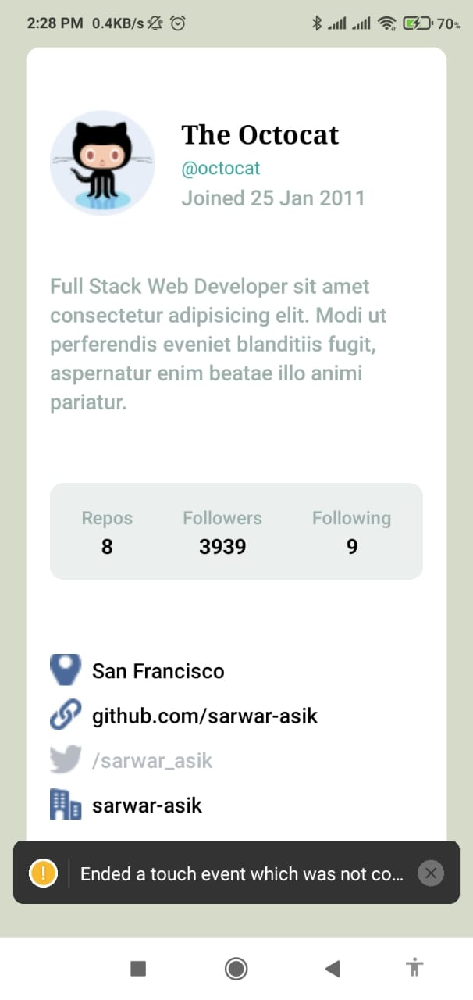

# Simple Profile Page Application

This is a Level-2 assignment application that showcases a profile page with three main sections: avatar, statistics, and address. The application is built using React Native, featuring reusable components and proper styling.

## Features

- **Avatar Section**: Displays the user's avatar image.
- **Statistics Section**: Shows user statistics such as posts, followers, and following.
- **Address Section**: Lists the user's address details.
- **Reusable Components**: Ensures code reusability and maintainability.
- **Proper Styling**: Utilizes React Native's `StyleSheet` for consistent and maintainable styling.

## Short Details

The application consists of three main sections:

1. **Avatar Section**: This section includes the user's avatar image.
2. **Statistics Section**: Displays various statistics related to the user.
3. **Address Section**: Lists the user's address information.

The components are reusable, making the code more maintainable and scalable. The application uses TypeScript for type safety and better development experience.

## Live Screenshots (Android)



## Technologies Used

- **React Native**: For building the mobile application.
- **TypeScript**: For type checking and ensuring code quality.
- **React Native StyleSheet**: For consistent styling across the application.

## Folder Structure

```
├── src
│ ├── components
│ │ ├── AvatarSection.tsx
│ │ ├── StatisticsSection.tsx
│ │ ├── AddressSection.tsx
│ ├── assets
│ │ ├── images
│ │ ├── avatar.png
│ │ ├── styles
│ │ ├── styles.ts
│ ├── App.tsx
├── README.md
```

## Installation and Usage

To run the application locally, follow these steps:

1. **Clone the repository**:

   ```sh
   git clone  https://github.com/sarwar-asik/profile-page-app-ass1
   cd profile-page-app-ass1
   ```

2. **Install dependencies**:

   ```sh
   npm install
   ```

3. **Run the application**:
   ```sh
     npx expo start
   ```
